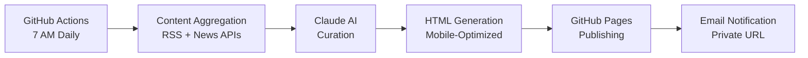

# 📰 Personal Newsletter Generator Agent

> An autonomous AI agent that generates a personalized daily newsletter using Claude AI, automatically published to GitHub Pages.

## 🌟 Features

- **🤖 Claude-Powered Curation**: Intelligent content selection that learns your preferences
- **📱 Mobile-First Design**: Beautiful reading experience optimized for phones and desktop
- **☁️ Cloud-Native**: Runs reliably on GitHub Actions (zero server costs)
- **🔒 Private Feedback System**: Improve curation without exposing preferences publicly
- **⚡ Zero Maintenance**: Fully automated - generates and publishes daily at 7 AM
- **📊 Smart Content Discovery**: Explores beyond RSS feeds using multiple sources

## 🚀 Quick Start (5 Minutes)

### 1. Create Repositories

You need two repositories:

1. **Code Repository**: Fork/clone this repo for the newsletter agent code
2. **Pages Repository**: Create `username.github.io` or enable Pages on any repo

### 2. Configure GitHub Secrets

In your **code repository**, go to `Settings → Secrets → Actions` and add:

```bash
# Required secrets
ANTHROPIC_API_KEY=sk-ant-xxxxx     # Get from console.anthropic.com
GITHUB_TOKEN=ghp_xxxxx             # GitHub Personal Access Token
GITHUB_PAGES_REPO=username/repo    # Where to publish (e.g., "john/john.github.io")
NEWS_API_KEY=xxxxx                 # Get from newsapi.org (optional)
FEEDBACK_SECRET=random_secure_key  # Any random string for private URLs

# Optional: Email notifications (for later)
USER_EMAIL=your-email@gmail.com
GMAIL_USER=your-gmail@gmail.com
GMAIL_APP_PASSWORD=app_password
```

### 3. Customize Your Preferences

Edit `data/preferences/user-preferences.json`:

```json
{
  "topics": {
    "technology": { "interest_score": 0.9, "keywords": ["ai", "startups", "crypto"] },
    "business": { "interest_score": 0.7, "keywords": ["markets", "economy"] }
  }
}
```

### 4. Test & Deploy

```bash
# Test locally (optional)
npm install
npm run build
npm run generate

# Deploy to GitHub
git add .
git commit -m "Setup newsletter agent"
git push origin main

# Trigger first run: Go to GitHub Actions → "Generate Daily Newsletter" → Run workflow
```

### 5. View Your Newsletter

Your newsletter will be published at:
- **Public**: `https://username.github.io/repo-name/newsletter/YYYY/MM/DD/`
- **Private** (with feedback): Sent to your email or check GitHub Actions logs

## 🛠️ How It Works



## 📁 Project Structure

```
newsletter-agent/
├── src/                        # TypeScript source code
│   ├── aggregators/            # Content fetching (RSS, APIs)
│   ├── curators/              # Claude AI curation logic
│   ├── formatters/            # HTML newsletter generation
│   ├── publishers/            # GitHub Pages publishing
│   └── core/                  # Configuration & scheduling
├── .github/workflows/         # GitHub Actions automation
├── templates/                 # Newsletter HTML templates
├── config/                    # Content sources & settings
└── data/                      # User preferences & cache
```

## ⚙️ Configuration

### Content Sources

Edit `config/sources/news-sources.json` to customize your news sources:

```json
{
  "rss_sources": [
    {
      "id": "techcrunch",
      "name": "TechCrunch",
      "url": "https://techcrunch.com/feed/",
      "category": "technology",
      "priority": 8
    }
  ]
}
```

### Newsletter Settings

Adjust timing and content in GitHub Actions workflow or environment variables:

```yaml
env:
  NEWSLETTER_TIME: "07:00"    # When to generate
  TIMEZONE: "America/Los_Angeles"
  MAX_ARTICLES: 15            # Articles per newsletter
```

## 📊 Monitoring & Debugging

- **GitHub Actions**: Check the Actions tab for execution logs
- **Artifacts**: Download logs and cache files for debugging
- **Manual Trigger**: Use "Manual Newsletter Generation" workflow for testing
- **Health Check**: Built-in system health verification

## 🔧 Troubleshooting

### Newsletter Not Generated

1. Check GitHub Actions permissions (Settings → Actions → General)
2. Verify all required secrets are set correctly
3. Ensure target repository has Pages enabled
4. Check API quotas (Anthropic, News API)

### Empty Newsletter

1. Check if RSS feeds are accessible
2. Verify user preferences match available content
3. Lower quality thresholds in curation settings
4. Enable debug mode for detailed logs

### Scheduling Issues

1. Verify cron syntax in workflow file
2. Check timezone settings
3. GitHub Actions may have slight delays

## 🚀 Advanced Features

### Adding New Content Sources

1. Edit `config/sources/news-sources.json`
2. Add RSS feeds or API integrations
3. Update aggregator code for new source types

### Customizing Design

1. Modify `templates/newsletter/base.hbs`
2. Update CSS in the template
3. Test locally with `npm run generate`

### Email Notifications

Set up Gmail app password and configure email secrets for daily private URL delivery.

## 📈 Roadmap

- [x] **MVP**: Basic RSS + Claude curation + GitHub Pages
- [ ] **Feedback System**: Click feedback to improve curation
- [ ] **Email Delivery**: Daily email with private URL
- [ ] **Enhanced Discovery**: Twitter, Reddit, Hacker News integration
- [ ] **Analytics**: Reading patterns and engagement metrics
- [ ] **Mobile App**: PWA with offline reading

## 💡 Why This Approach?

**GitHub Actions vs. Local/Server:**

- ✅ **$0 Cost**: Completely free on GitHub's infrastructure
- ✅ **Zero Maintenance**: No server management or uptime monitoring
- ✅ **Reliable**: Cloud-based execution, no sleep/power issues
- ✅ **Scalable**: Easy migration to paid services when needed
- ✅ **Secure**: Built-in secrets management
- ✅ **Transparent**: All execution logs visible and debuggable

## 🤝 Contributing

This is a personal project template, but improvements welcome!

1. Fork the repository
2. Create a feature branch
3. Submit a pull request

## 📄 License

MIT License - feel free to use for personal newsletters!

---

**Ready to wake up to perfectly curated news every morning? ☕**

Start your setup now and have your personalized AI newsletter running by tomorrow!