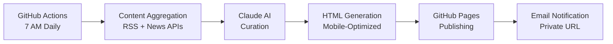

# 🤖 AI Newsletter Generator

> An automated newsletter generator that curates high-quality AI/tech blog content from expert sources, with multi-tier AI curation and automated GitHub Pages deployment.

## ✨ Features

- **🎯 Expert Curation**: Pulls content from 100+ AI/tech blogs listed in `ai_blogs.md`
- **🤖 Multi-Tier AI**: Free rule-based → Budget OpenAI → Premium Claude curation
- **📅 Automated Scheduling**: Daily generation via GitHub Actions
- **🌐 GitHub Pages**: Automatic publishing with beautiful responsive design
- **📱 Mobile-First**: Clean, readable design with dark/light mode support
- **🔍 Smart Discovery**: Automatically discovers RSS feeds from blog URLs

## 🚀 Quick Start

### 1. Fork & Clone
```bash
git clone https://github.com/yourusername/newsletter.git
cd newsletter
npm install
```

### 2. Local Development
```bash
# Generate newsletter locally (free tier)
npm run generate

# View in browser
open ./output/newsletter.html
```

### 3. GitHub Pages Setup

#### Enable GitHub Pages
1. Go to your repository → Settings → Pages
2. Source: "GitHub Actions"
3. The workflow will automatically deploy to: `https://yourusername.github.io/newsletter`

#### Configure Secrets (Optional - for AI curation)
Go to Settings → Secrets and Variables → Actions:

```bash
# AI Provider (optional)
LLM_PROVIDER=free        # 'free', 'openai', or 'claude'
MONTHLY_BUDGET_LIMIT=0.00  # Budget limit

# OpenAI (if using openai provider)
OPENAI_API_KEY=your_key_here

# Claude (if using claude provider)  
CLAUDE_API_KEY=your_key_here
```

### 4. Automatic Scheduling
The newsletter will automatically:
- 📅 Generate daily at 8 AM UTC
- 🚀 Deploy to GitHub Pages
- 💾 Archive previous editions

### 5. Feedback System Setup (Giscus)
This project uses Giscus to collect feedback on articles. To set it up, you need to:

1.  **Create a public repository** to store the discussions. This can be the same repository as the newsletter, or a separate one.
2.  **Enable the "Discussions" feature** in the repository settings.
3.  **Install the Giscus app** on the repository by visiting [giscus.app](https://giscus.app) and following the instructions.
4.  **Create a new discussion category** named "Announcements".
5.  **Get the repository ID and category ID**. You can get these from the Giscus configuration page.
6.  **Update the Giscus script** in `templates/newsletter/base.hbs` with your repository and category details.

## 🛠️ How It Works



## 📁 Project Structure

```
newsletter-agent/
├── src/                        # TypeScript source code
│   ├── aggregators/            # Content fetching (RSS, APIs)
│   ├── curators/              # Claude AI curation logic
│   ├── formatters/            # HTML newsletter generation
│   ├── publishers/            # GitHub Pages publishing
│   └── core/                  # Configuration & scheduling
├── .github/workflows/         # GitHub Actions automation
├── templates/                 # Newsletter HTML templates
├── config/                    # Content sources & settings
└── data/                      # User preferences & cache
```

## ⚙️ Configuration

### Content Sources

Edit `config/sources/news-sources.json` to customize your news sources:

```json
{
  "rss_sources": [
    {
      "id": "techcrunch",
      "name": "TechCrunch",
      "url": "https://techcrunch.com/feed/",
      "category": "technology",
      "priority": 8
    }
  ]
}
```

### Newsletter Settings

Adjust timing and content in GitHub Actions workflow or environment variables:

```yaml
env:
  NEWSLETTER_TIME: "07:00"    # When to generate
  TIMEZONE: "America/Los_Angeles"
  MAX_ARTICLES: 15            # Articles per newsletter
```

## 📊 Monitoring & Debugging

- **GitHub Actions**: Check the Actions tab for execution logs
- **Artifacts**: Download logs and cache files for debugging
- **Manual Trigger**: Use "Manual Newsletter Generation" workflow for testing
- **Health Check**: Built-in system health verification

## 🔧 Troubleshooting

### Newsletter Not Generated

1. Check GitHub Actions permissions (Settings → Actions → General)
2. Verify all required secrets are set correctly
3. Ensure target repository has Pages enabled
4. Check API quotas (Anthropic, News API)

### Empty Newsletter

1. Check if RSS feeds are accessible
2. Verify user preferences match available content
3. Lower quality thresholds in curation settings
4. Enable debug mode for detailed logs

### Scheduling Issues

1. Verify cron syntax in workflow file
2. Check timezone settings
3. GitHub Actions may have slight delays

## 🚀 Advanced Features

### Adding New Content Sources

1. Edit `config/sources/news-sources.json`
2. Add RSS feeds or API integrations
3. Update aggregator code for new source types

### Customizing Design

1. Modify `templates/newsletter/base.hbs`
2. Update CSS in the template
3. Test locally with `npm run generate`

### Email Notifications

Set up Gmail app password and configure email secrets for daily private URL delivery.

## 📈 Roadmap

- [x] **MVP**: Basic RSS + Claude curation + GitHub Pages
- [x] **Feedback System**: Click feedback to improve curation
- [ ] **Email Delivery**: Daily email with private URL
- [ ] **Enhanced Discovery**: Twitter, Reddit, Hacker News integration
- [ ] **Analytics**: Reading patterns and engagement metrics
- [ ] **Mobile App**: PWA with offline reading

## 💡 Why This Approach?

**GitHub Actions vs. Local/Server:**

- ✅ **$0 Cost**: Completely free on GitHub's infrastructure
- ✅ **Zero Maintenance**: No server management or uptime monitoring
- ✅ **Reliable**: Cloud-based execution, no sleep/power issues
- ✅ **Scalable**: Easy migration to paid services when needed
- ✅ **Secure**: Built-in secrets management
- ✅ **Transparent**: All execution logs visible and debuggable

## 🤝 Contributing

This is a personal project template, but improvements welcome!

1. Fork the repository
2. Create a feature branch
3. Submit a pull request

## 📄 License

MIT License - feel free to use for personal newsletters!

---

**Ready to wake up to perfectly curated news every morning? ☕**

Start your setup now and have your personalized AI newsletter running by tomorrow!